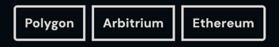

# CLBButtonGroup
Button groups are a group of related actions that may be used to paginate results, tab sections of pages, or simply select an option.



## Usage
```jsx
<CLBButtonGroup>
	<CLBButtonGroupItem id="polygon" name="network" value="polygon">
		Polygon
	</CLBButtonGroupItem>
	<CLBButtonGroupItem id="arbitrium" name="network" value="arbitrium">
		Arbitrium
	</CLBButtonGroupItem>
	<CLBButtonGroupItem id="ethereum" name="network" value="ethereum">
		Ethereum
	</CLBButtonGroupItem>
</CLBButtonGroup>
```

## Props
| Prop       | Type    | Default | Description                                          |
|------------|---------|---------|------------------------------------------------------|
| id         | string  | null    | The component's id.                                  |
| name       | string  | null    | The component's name.                                |
| value      | string  | null    | The component's value.                               |
| isChecked  | boolean | false   | Boolean toggle to set the button to checked or not.  |
| isDisabled | boolean | false   | Boolean toggle to set the button to disabled or not. |

## Slots
| Slot    | Description      |
|---------|------------------|
| default | The button text. |

## Detailed API Documentation

A detailed API documentation is available whenever you want to change something in the component manually--like using
the class names API, or CSS variables API. The documentation is located in
the [Hashi documentation](https://hashi-docs.netlify.app/docs/develop/button-group) of this component's base component.
