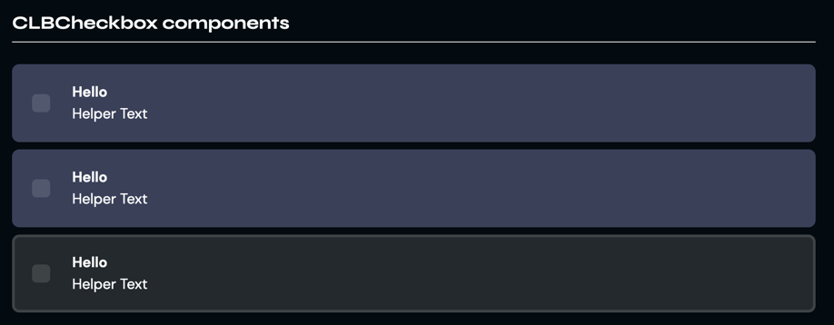

# CLBCheckbox
Checkboxes take and validate predetermined inputs of the user in a context of a form, or simple querying. They can have multiple selected values per field.



```jsx
<CLBCheckbox
	name="String"
	id="String"
	value="String"
	type="String"
	label="String"
	helper="String"
	media="String"
	mediaAlt="String"
	isChecked
	isDisabled
	onChange={() => {}}
/>
```

## Props

> `*` = required

| Prop      | Type                  | Default | Description                                                     |
|-----------|-----------------------|---------|-----------------------------------------------------------------|
| name*     | string                | null    | The component's name.                                           |
| id        | string                | null    | The component's id.                                             |
| type      | CheckboxTypes\|string | null    | The component's type.                                           |
| value     | string                | null    | The component's default value.                                  |
| label*    | string                | null    | The component's label.                                          |
| helper    | string                | null    | The component's helper text.                                    |
| media     | string                | null    | The sprite/icon for the left side of the component.             |
| mediaAlt  | string                | null    | The alt text for the media.                                     |
| isChecked | boolean               | false   | Boolean toggle to set the checkbox to checked or not.           |
| onChange  | () => void            | null    | Function to execute when watching for changes to the component. |

## Detailed API Documentation

A detailed API documentation is available whenever you want to change something in the component manually--like using
the class names API, or CSS variables API. The documentation is located in
the [Hashi documentation](https://hashi-docs.netlify.app/docs/develop/tick-field) of this component's base component.
