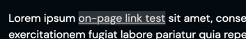

# CLBLink

Links are elements that take a user from one webpage to another. These are often found inline with regular text.



## Usage

```jsx
<CLBLink link="String">Link sample.</CLBLink>
```

## Props

| Prop | Type   | Default | Description        |
|------|--------|---------|--------------------|
| link | String | null    | The link required. |

## Slots

| Slot    | Description    |
|---------|----------------|
| default | The link text. |

## Detailed API Documentation

A detailed API documentation is available whenever you want to change something in the component manually--like using
the class names API, or CSS variables API. The documentation is located in
the [Hashi documentation](https://hashi-docs.netlify.app/docs/develop/link) of this component's base component.
