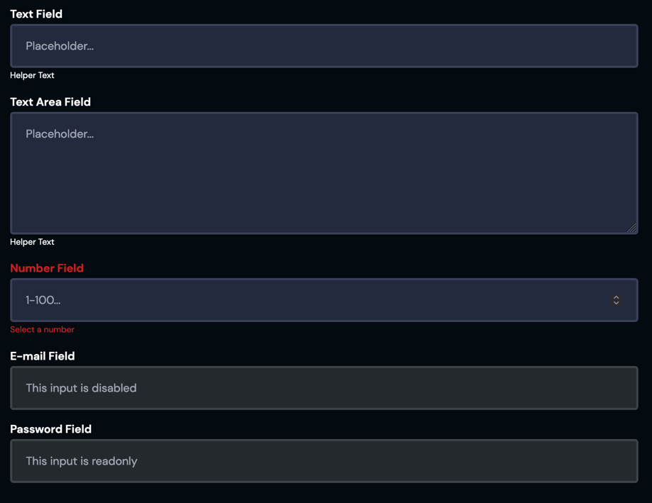

# CLBFormField

Form fields take and validate inputs the user in a context of a form, or simple querying.



```sveltehtml
<CLBFormField
	label="String"
	name="String"
	type="String"
	inputType="String"
	helper="String"
	placeholder="String"
	rows={5}
	isRequired
	isDisabled
	isReadonly
/>

<script>
import {CLBFormField} from '@devprotocol/clubs-core/ui/svelte';
</script>
```

## Props

> `*` = required

| Prop        | Type                   | Default | Description                        |
|-------------|------------------------|---------|------------------------------------|
| label*      | string                 | null    | The component's label.             |
| name*       | string                 | null    | The component's name.              |
| type        | FormFieldTypes\|string | null    | The component's type.              |
| inputType*  | string                 | null    | The component's input type.        |
| helper      | string                 | null    | The component's helper text.       |
| placeholder | string                 | null    | The component's placeholder.       |
| rows        | number                 | 5       | The component's rows.              |
| isRequired  | boolean                | false   | Whether the component is required. |
| isDisabled  | boolean                | false   | Whether the component is disabled. |
| isReadonly  | boolean                | false   | Whether the component is readonly. |

## Detailed API Documentation

A detailed API documentation is available whenever you want to change something in the component manually--like using
the class names API, or CSS variables API. The documentation is located in
the [Hashi documentation](https://hashi-docs.netlify.app/docs/develop/form-field) of this component's base component.
