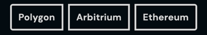

# CLBButtonGroup
Button groups are a group of related actions that may be used to paginate results, tab sections of pages, or simply select an option.



## Usage
```vue
<template>
  <CLBButtonGroup>
    <CLBButtonGroupItem id="polygon" name="network" value="polygon">
      Polygon
    </CLBButtonGroupItem>
    <CLBButtonGroupItem id="arbitrium" name="network" value="arbitrium">
      Arbitrium
    </CLBButtonGroupItem>
    <CLBButtonGroupItem id="ethereum" name="network" value="ethereum">
      Ethereum
    </CLBButtonGroupItem>
  </CLBButtonGroup>
</template>

<script>
import {CLBButtonGroup, CLBButtonGroupItem} from '@devprotocol/clubs-core/ui/vue';

export default {
  components: {CLBButtonGroup, CLBButtonGroupItem}
}
</script>
```

## Props
| Prop  | Type    | Default | Description                    |
|-------|---------|---------|--------------------------------|
| id    | String  | null    | The identifier for the button. |
| name  | String  | null    | The name for the button.       |
| value | String  | null    | The value of the button.       |

## Slots
| Slot    | Description      |
|---------|------------------|
| default | The button text. |

## Detailed API Documentation

A detailed API documentation is available whenever you want to change something in the component manually--like using
the class names API, or CSS variables API. The documentation is located in
the [Hashi documentation](https://hashi-docs.netlify.app/docs/develop/button-group) of this component's base component.
