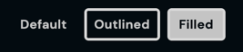

# CLBButton

Buttons call the user to a specific action in the page. May it be in a form, or a hyperlink.


## Usage

```vue
<template>
  <CLBButton
      link="String"
      isDisabled="Boolean"
      type="String"
  >Click Me
  </CLBButton>
</template>

<script>
import {CLBButton} from '@devprotocol/clubs-core/ui/vue';

export default {
  components: {CLBButton}
}
</script>
```

## Props

| Prop       | Type    | Default | Description                     |
|------------|---------|---------|---------------------------------|
| link       | String  | null    | The link required.              |
| isDisabled | Boolean | false   | Whether the button is disabled. |
| type       | String  | `''`    | The type of button.             |

### Available types

#### 1. Text

Text buttons are used for the least prioritized actions. These are used as action alternatives, or actions to be third
and beyond in consideration.

#### 2. Outlined

Outlined buttons are used for secondarily prioritized actions. These are used as action alternatives, or actions to be
second in consideration.

#### 3. Filled

Filled buttons are used for the most prioritized actions. These are used for actions you want the user to see/consider
first.

#### 5. Small



Small buttons are a smaller version of the normal-sized buttons. These are used in tight spaces in which a normal-sized
button cannot fit in.

#### 6. Large


Large buttons are a larger version of the normal-sized buttons. These are used typically in big call to actions (CTAs)
in marketing pages like the hero in the index page.

#### 7. Fullwidth\*

Fullwidth buttons are buttons that fill up 100% of its width in a container.

#### 8. Contained\*

Contained buttons are buttons that only stretch to its maximum content width.

> `*` = not available in the skeleton version.

## Slots

| Slot    | Description      |
|---------|------------------|
| default | The button text. |
| icon    | The button icon. |

## Detailed API Documentation

A detailed API documentation is available whenever you want to change something in the component manually--like using
the class names API, or CSS variables API. The documentation is located in
the [Hashi documentation](https://hashi-docs.netlify.app/docs/develop/button) of this component's base component.
