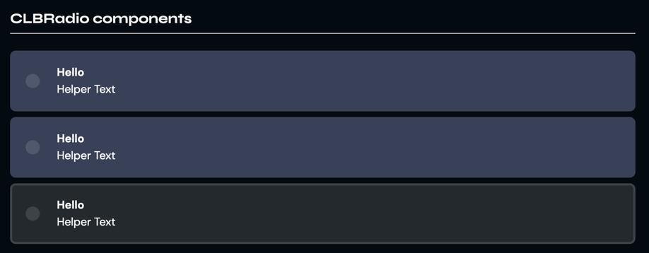

# CLBRadio
Radio fields take and validate predetermined inputs of the user in a context of a form, or simple querying. They can only have a single selected value per field.



```vue
<template>
  <CLBRadio
	  name="String"
	  id="String"
	  value="String"
	  type="String"
	  label="String"
	  helper="String"
	  media="String"
	  mediaAlt="String"
	  isChecked="Boolean"
	  isDisabled="Boolean"
	  onChange="Function"
  />
</template>

<script>
import {CLBRadio} from '@devprotocol/clubs-core/ui/vue';

export default {
  components: {CLBRadio}
}
</script>
```

## Props

> `*` = required

| Prop      | Type       | Default | Description                                                     |
|-----------|------------|---------|-----------------------------------------------------------------|
| name*     | `String`   | n/a     | The component's name.                                           |
| value     | `String`   | null    | The component's default value.                                  |
| label*    | `String`   | n/a     | The component's label.                                          |
| helper    | `String`   | null    | The component's helper text.                                    |
| media     | `String`   | null    | The sprite/icon for the left side of the component.             |
| mediaAlt  | `String`   | null    | The alt text for the media.                                     |
| isChecked | `Boolean`  | false   | Boolean toggle to set the checkbox to checked or not.           |
| onChange  | `Function` | null    | Function to execute when watching for changes to the component. |

## Detailed API Documentation

A detailed API documentation is available whenever you want to change something in the component manually--like using
the class names API, or CSS variables API. The documentation is located in
the [Hashi documentation](https://hashi-docs.netlify.app/docs/develop/tick-field) of this component's base component.
