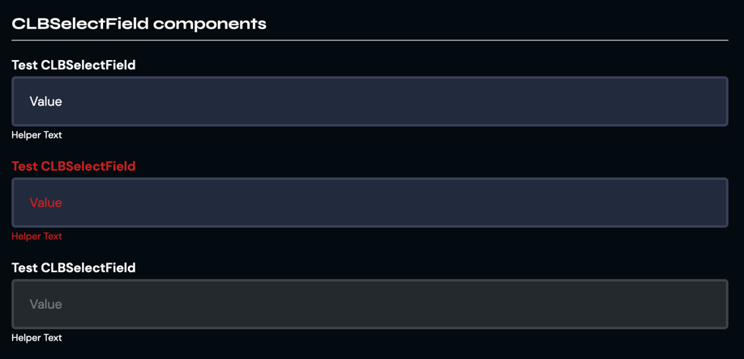

# CLBFormField

Select fields lets the user pick an option from a finite set of choices, and validate the option in a context of a form,
or simple filtering.



```vue
<template>
  <CLBSelectField
      label="String"
      name="String"
      type="String"
      helper="String"
      isRequired="Boolean"
      isDisabled="Boolean"
  >
    <option value="Option">Option</option>
    ...
  </CLBSelectField>
</template>

<script>
import {CLBSelectField} from '@devprotocol/clubs-core/ui/vue';

export default {
  components: {CLBSelectField}
}
</script>
```

## Props

> `*` = required

| Prop        | Type    | Default | Description                        |
|-------------|---------|---------|------------------------------------|
| label*      | String  | null    | The component's label.             |
| name*       | String  | null    | The component's name.              |
| type        | String  | null    | The component's type.              |
| helper      | String  | null    | The component's helper text.       |
| isRequired  | Boolean | false   | Whether the component is required. |
| isDisabled  | Boolean | false   | Whether the component is disabled. |

## Slots
| Slot    | Description                          |
|---------|--------------------------------------|
| default | Entry point for `<option>` elements. |

## Detailed API Documentation

A detailed API documentation is available whenever you want to change something in the component manually--like using
the class names API, or CSS variables API. The documentation is located in
the [Hashi documentation](https://hashi-docs.netlify.app/docs/develop/select-field) of this component's base component.
